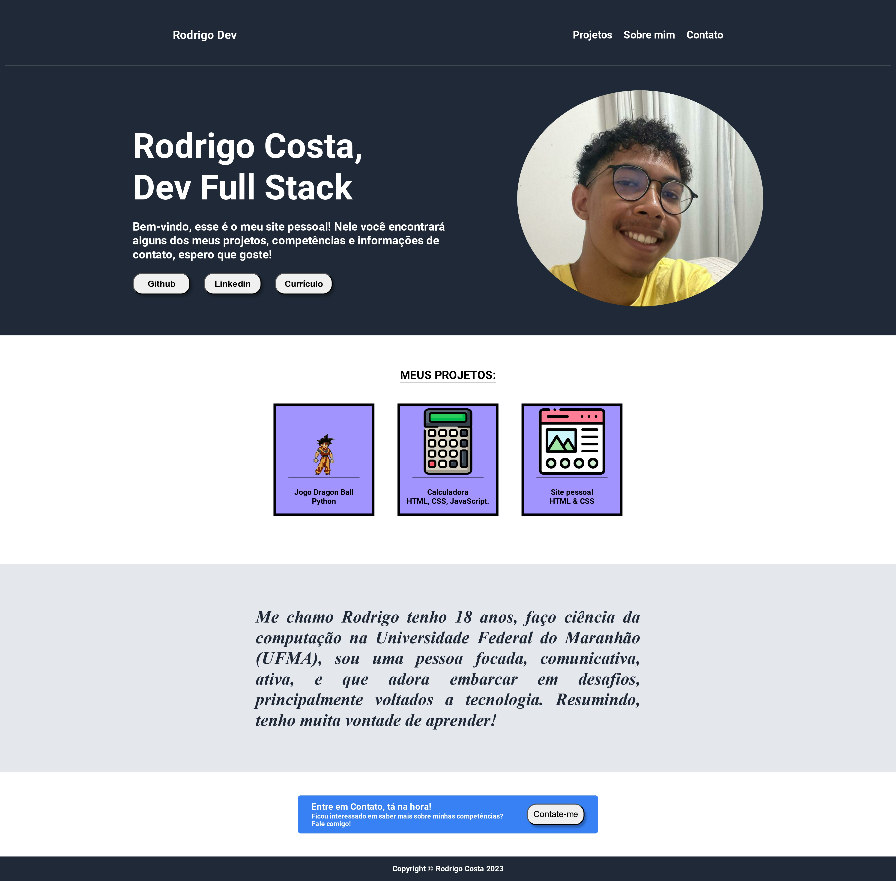

<h1>Site pessoal - Rodrigo Dev.</h1>

<h2> Introdução</h2>

 Trata-se de site um site feito com HTML & CSS, criado para treinar principalmente os conceitos de FlexBox e conseguir aprimorar minhas práticas no Front-End. O site apresenta alguns dos meus projetos (atuais e futuros), um pouco sobre mim e algumas informações de contato.

 

<h2>The Odin Project</h2>

Esse site foi um projeto desenvolvido para o curso da The Odin Project, seguindo como paramêtro o seguinte exemplo: <a href="https://cdn.statically.io/gh/TheOdinProject/curriculum/81a5d553f4073e593d23a6ab00d50eef8620796d/foundations/html_css/project/imgs/01.png">Exemplo de site</a>. Fiz algumas mudanças mas tentei deixar o projeto parecido principalmente na estrutura.

<h3>Menção a Rafa Ballerini</h3>

Gostaria de agradecer também a criadora de conteúdo Rafa Ballerini, pois ao ver os vídeos dela de Flexbox e de Landing Page, muitas coisas se esclareceram

 

<h1>Personal Website - Rodrigo Dev.</h1>
<h2>Introduction</h2>

This is a website created using HTML & CSS, designed to practice and improve my skills in Front-End development, particularly focusing on Flexbox concepts. The site showcases some of my current and future projects, provides information about myself, and includes contact details.

 
<h2>The Odin Project</h2>

This website was developed as a project for The Odin Project course, based on the following example: <a href="https://cdn.statically.io/gh/TheOdinProject/curriculum/81a5d553f4073e593d23a6ab00d50eef8620796d/foundations/html_css/project/imgs/01.png">Example website</a>. I made some changes but tried to maintain a similar structure to the project.

<h3>Mentioning Rafa Ballerini</h3>

I would also like to thank content creator Rafa Ballerini because her videos on Flexbox and Landing Page provided a lot of clarification for me.

